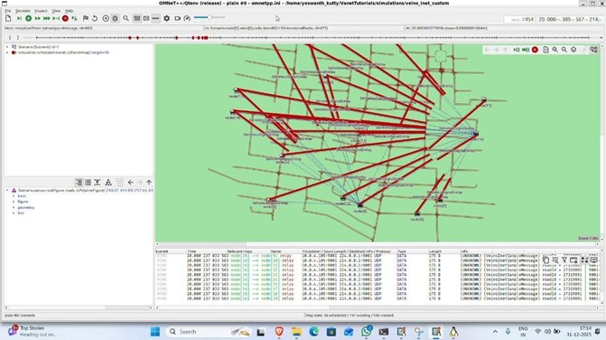
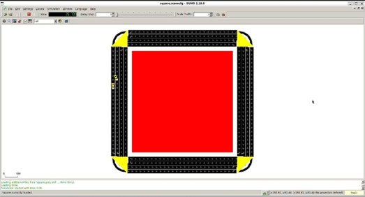
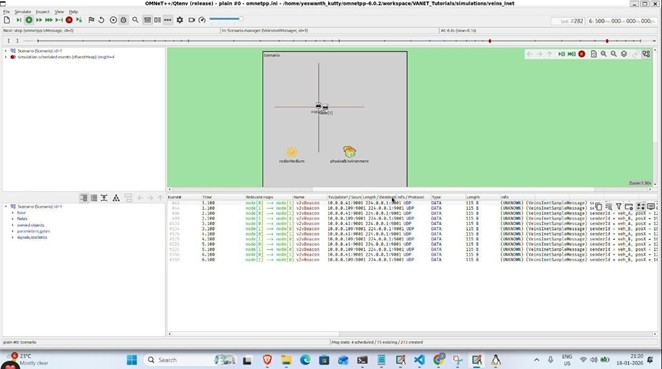

# Autonomous Vehicle V2V Communication System

A Vehicular Ad-Hoc Network (VANET) simulation framework implementing Vehicle-to-Vehicle (V2V) communication with a primary focus on intersection collision avoidance. The project is built on OMNeT++, Veins, INET, and SUMO, and covers a progressive set of simulations from basic wireless communication through AODV routing to a fully custom V2V collision prevention application with IEEE 802.11p radio.


## Table of Contents

- [Overview](#overview)
- [Simulation Architecture](#simulation-architecture)
- [Project Structure](#project-structure)
- [Prerequisites](#prerequisites)
- [Installation and Build](#installation-and-build)
- [Running Simulations](#running-simulations)
- [Results and Output](#results-and-output)


## Overview

This project simulates autonomous vehicle communication in a VANET environment. Vehicles communicate over IEEE 802.11p (DSRC/WAVE) radio at the 5.9 GHz band, exchanging periodic position beacons. The primary scenario places two vehicles on perpendicular collision courses at an uncontrolled intersection. V2V beaconing detects the impending conflict and triggers an emergency braking response before impact.

The framework is also used to study AODV-based routing under varying node mobility, static multi-hop wireless routing, and the integration of real road networks via OpenStreetMap and SUMO traffic simulation.


## Simulation Architecture

The simulation stack consists of four integrated tools.

OMNeT++ serves as the discrete-event simulation engine. Network topology, module hierarchy, and inter-module connections are declared in NED files. Simulation parameters are configured through `omnetpp.ini` files.

INET Framework provides the full protocol stack — IP, UDP, IEEE 802.11p MAC and PHY layers, mobility models, and network visualizers.

Veins bridges OMNeT++ with SUMO through the TraCI (Traffic Control Interface) protocol. The `VeinsInetManager` module connects to SUMO over TCP (port 9999), spawning and removing OMNeT++ vehicle modules as vehicles enter and exit the SUMO simulation. `VeinsInetMobility` synchronises each vehicle's position and heading from SUMO into OMNeT++ at every 0.1 s update interval.

SUMO simulates realistic road traffic. Road networks are defined as `.net.xml` files (generated from edge/node XML via `netconvert`, or imported from OpenStreetMap). Vehicle routes and departure times are defined in `.rou.xml` files. The launch configuration (`*.launchd.xml`) is read by Veins to start SUMO automatically.

```
OMNeT++ + INET + Veins  <---TraCI TCP:9999--->  SUMO
     |                                             |
 NED topology                              Road network (.net.xml)
 omnetpp.ini config                        .rou.xml routes
 C++ application logic                     .sumocfg settings
 802.11p PHY/MAC                           Vehicle dynamics
```


## Project Structure

```
Autonomus V2V Communication/
│
├── Backup-Workspace/
│   (Contains V1 backup simulation files)
│
├── Code Files/
│   (Contains simulation code files for each scenario and map files)
│
├── Demo/
│   (Contains simulation demos for each scenario)
│
├── Docs/
│   (Contains project report, presentations, scenario descriptions, etc.)
│
├── Hardware Files/
│   (Contains Arduino code files)
│
├── Libs/
│   (Library files for Veins and INET frameworks)
│
└── VANETTutorials-master/
    (Core project files with all simulation scenarios)
```


## Prerequisites

| Software | Version | Purpose |
|---|---|---|
| OMNeT++ | 6.x (or 5.7+) | Discrete-event simulation engine and IDE |
| INET Framework | 4.x | Protocol stack, mobility models, visualizers |
| Veins | 5.x | TraCI bridge between OMNeT++ and SUMO |
| SUMO | 1.6.0 or later | Road traffic simulation |
| Python | 3.x | For `run_v2v.py` and `run_crash.py` TraCI scripts |
| TraCI Python library | Bundled with SUMO | Python SUMO control API |

INET and Veins source are included under `Taarun/Libs/` for reference. It is recommended to build them from their official repositories to ensure version compatibility with your OMNeT++ installation.


## Installation and Build

### Step 1: Install SUMO

```bash
sudo apt-get install sumo sumo-tools sumo-doc
```

Ensure `sumo`, `sumo-gui`, and `netconvert` are available on your `PATH`.

### Step 2: Install OMNeT++

Download OMNeT++ from [omnetpp.org](https://omnetpp.org/), follow the platform build instructions, and source the environment:

```bash
source /path/to/omnetpp/setenv
```

### Step 3: Build INET

```bash
cd /path/to/inet
make makefiles
make -j$(nproc)
```

### Step 4: Build Veins

```bash
cd /path/to/veins
./configure --with-inet=/path/to/inet
make -j$(nproc)
```

### Step 5: Import and Build the Project

1. Open the OMNeT++ IDE
2. Go to `File > Import > General > Existing Projects into Workspace`
3. Select `Backup-Workspace/VANET_Tutorials`
4. Verify project references to INET and Veins under `Project Properties > Project References`
5. Build via `Project > Build All`, or from the command line:

```bash
cd Backup-Workspace/VANET_Tutorials
make
```

Build outputs:
- `out/gcc-release/src/libVANET_Tutorials.so` — release shared library
- `out/gcc-debug/src/libVANET_Tutorials_dbg.so` — debug shared library


## Running Simulations

### Starting the Veins SUMO Launch Daemon

Required for scenarios that use `erlangen.launchd.xml` or similar external launch configs (the `veins/` scenario):

```bash
cd /path/to/veins
python bin/veins_launchd -vv
```

This starts the daemon on TCP port 9999. Keep it running for the duration of the simulation. Scenarios using an inline `<launch>` block in `intersection.launchd.xml` (the `Intersection` and `veins_inet` scenarios) start SUMO automatically and do not require the daemon.

### Running via OMNeT++ IDE

1. Right-click the target `omnetpp.ini`
2. Select `Run As > OMNeT++ Simulation`
3. Choose the configuration from the dropdown
4. Click `Run` for interactive Qtenv mode or `Run without GUI` for batch Cmdenv mode


## Results and Output

Simulation results are stored in each scenario's `results/` directory in OMNeT++ native format.

| Extension | Contents |
|---|---|
| `.sca` | Scalar statistics — per-run summary metrics |
| `.vec` | Vector statistics — time-series data |
| `.vci` | Vector index file for efficient `.vec` access |
| `.rt` | Routing table snapshots (AODV scenarios) |







Results are analysed using the OMNeT++ Analysis Tool built into the IDE, or exported to CSV for external processing. Key metrics across scenarios include packet delivery ratio, end-to-end delay, AODV route discovery latency, and collision prevention success rate.

The Intersection scenario additionally produces `collisions.xml` (SUMO output) when collision logging is enabled in `intersection.launchd.xml`, recording the exact time and position of any collision events in the baseline (`run_crash.py`) run.

## Contributing

This is currently a personal development project and work-in-progress repository.

Suggestions, improvements, and automation ideas are always welcome.

## License

This project is developed for educational and experimental purposes.
